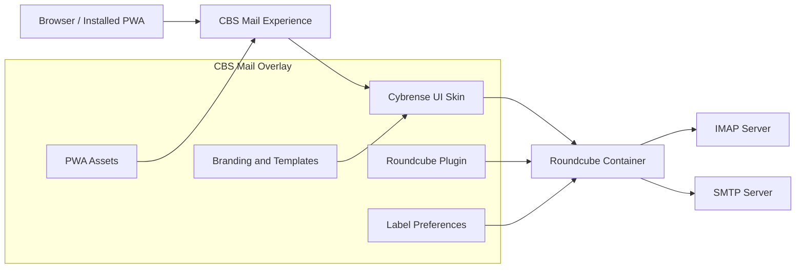

<p align="center">
  <a href="https://github.com/Cybrense-IT-Services/CBS_Mail">
    
  </a>
</p>

<h1 align="center">CBS Mail</h1>

<p align="center">
  Created and developed by <a href="https://github.com/Cybrense-IT-Services/CBS_Mail/graphs/contributors"><strong>CBS Team</strong></a>
</p>

<p align="center">
  A modern, mobile-ready Roundcube webmail experience with a custom Cybrense/CBS
  UI skin, plugin layer, PWA support, and synchronized per-user label management.
</p>

<p align="center">
  <a href="https://github.com/Cybrense-IT-Services/CBS_Mail/blob/main/LICENSE"></a>
  <a href="https://github.com/Cybrense-IT-Services/CBS_Mail/actions/workflows/ci.yml"></a>
  <a href="https://roundcube.net/"></a>
  <a href="https://cybrense.com/"></a>
  
  
  
</p>

<p align="center">
  <a href="https://cbsmail.cybrense.com/"></a>
  <a href="https://github.com/Cybrense-IT-Services/CBS_Mail"></a>
  <a href="https://github.com/Cybrense-IT-Services/CBS_Mail/releases/latest"></a>
</p>

<p align="center">
  <a href="https://github.com/Cybrense-IT-Services/CBS_Mail/actions/workflows/ci.yml"></a>
  <a href="https://github.com/Cybrense-IT-Services/CBS_Mail/blob/main/LICENSE"></a>
  <a href="https://github.com/Cybrense-IT-Services/CBS_Mail/graphs/contributors"></a>
  <a href="https://github.com/roundcube/roundcubemail"></a>
  
  
  
</p>

<p align="center">
  <a href="#about-cbs-mail">About</a>
  &nbsp;&bull;&nbsp;
  <a href="#product-preview">Preview</a>
  &nbsp;&bull;&nbsp;
  <a href="#experience-highlights">Highlights</a>
  &nbsp;&bull;&nbsp;
  <a href="#feature-map">Features</a>
  &nbsp;&bull;&nbsp;
  <a href="#architecture">Architecture</a>
  &nbsp;&bull;&nbsp;
  <a href="#my-contributions">Contributions</a>
  &nbsp;&bull;&nbsp;
  <a href="#technology">Technology</a>
  &nbsp;&bull;&nbsp;
  <a href="#official-project-links">Links</a>
</p>

---

## At a Glance

| Destination | Purpose | Link |
| --- | --- | --- |
| **Live product website** | Explore the public CBS Mail experience and product presentation. | [Open cbsmail.cybrense.com](https://cbsmail.cybrense.com/) |
| **Official source** | Browse the maintained codebase, documentation, releases, and CI. | [Cybrense-IT-Services/CBS_Mail](https://github.com/Cybrense-IT-Services/CBS_Mail) |
| **Contribution history** | Review commits authored by MrBoodj011 in the official repository. | [View authored commits](https://github.com/Cybrense-IT-Services/CBS_Mail/commits/main/?author=MrBoodj011) |
| **Project contributors** | See the full CBS Team contribution graph. | [View contributors](https://github.com/Cybrense-IT-Services/CBS_Mail/graphs/contributors) |
| **Roundcube upstream** | Explore the open-source webmail foundation used by CBS Mail. | [roundcube/roundcubemail](https://github.com/roundcube/roundcubemail) |

> [!IMPORTANT]
> This repository is a focused project showcase. The actively maintained source,
> issues, releases, security policy, and contribution workflow live in the
> [official CBS Mail repository](https://github.com/Cybrense-IT-Services/CBS_Mail).

## About CBS Mail

**CBS Mail** is a modern, mobile-ready webmail experience developed by the
**CBS Team** at [Cybrense IT Services](https://github.com/Cybrense-IT-Services).
It keeps Roundcube as the reliable mail engine and adds a polished product layer
for organizations that need a branded, responsive, and app-like interface.

The project brings together:

- a custom Cybrense/CBS visual system,
- a responsive desktop, tablet, and mobile shell,
- a dedicated Roundcube plugin layer,
- synchronized per-user email labels,
- PWA installation and safe offline behavior,
- privacy-aware remote-content controls,
- Docker-based deployment,
- and automated browser, security, and quality checks.

CBS Mail is an enhancement layer around Roundcube. IMAP and SMTP remain handled
by the configured mail infrastructure, while CBS Mail focuses on the user
experience, branding, integration, and deployment workflow.

## Product Preview

<table>
  <tr>
    <td width="72%" align="center">
      <a href="https://cbsmail.cybrense.com/">
        
      </a>
      <br>
      <strong>Desktop workspace</strong>
    </td>
    <td width="28%" align="center">
      <a href="https://cbsmail.cybrense.com/">
        
      </a>
      <br>
      <strong>Mobile mailbox</strong>
    </td>
  </tr>
</table>

<p align="center">
  <a href="https://cbsmail.cybrense.com/"><strong>Explore the live website</strong></a>
  &nbsp;&bull;&nbsp;
  <a href="https://github.com/Cybrense-IT-Services/CBS_Mail"><strong>Browse the official source</strong></a>
  &nbsp;&bull;&nbsp;
  <a href="https://github.com/Cybrense-IT-Services/CBS_Mail/releases/latest"><strong>View the latest release</strong></a>
</p>

## Experience Highlights

| | Highlight | What it delivers |
| --- | --- | --- |
| **01** | **Branded interface** | A consistent Cybrense/CBS identity across login, mail, compose, contacts, settings, dialogs, and notifications. |
| **02** | **Responsive workflow** | Desktop, tablet, and mobile layouts with touch-friendly navigation and focused message actions. |
| **03** | **App-like delivery** | PWA metadata, installable icons, a lightweight service worker, and a safe offline fallback. |
| **04** | **Personal labels** | Multiple labels per message, filtering, counts, assignment controls, and synchronized Roundcube user preferences. |
| **05** | **Privacy controls** | A branded remote-content trust flow for known senders and explicitly configured domains. |
| **06** | **Reproducible deployment** | A Docker overlay image, Compose configuration, health checks, backup guidance, and production examples. |

## Feature Map

### Interface and Navigation

- Branded Roundcube Elastic UI overlay.
- Dark app shell with a clean content workspace.
- Unified styling for Mail, Contacts, Settings, Login, Compose, and message views.
- Responsive drawers, message cards, toolbars, forms, and dialogs.
- Mobile-first interaction targets and PWA-friendly viewport behavior.

### Labels and Preferences

- Account-specific labels stored in Roundcube user preferences.
- One-click assignment and removal.
- Multiple labels on a single message.
- Sidebar filtering and live label counts.
- Label badges in the message list and message view.
- Migration support for earlier account-scoped browser data.

### PWA and Notifications

- Installable desktop and mobile experience.
- Web app manifest, icons, Apple touch icon, and service worker.
- Network-first behavior that avoids caching authenticated email content.
- Official Roundcube browser notifications.
- Configurable new-mail refresh behavior.

### Privacy and Trust

- Roundcube's remote-resource privacy model remains enabled.
- Known-sender and trusted-domain controls are integrated into the CBS interface.
- Trusted sender preferences remain account-specific.
- Deployment documentation explains the security boundary of trusted domains.

### Deployment and Operations

- Static web app manifest.
- App icons and Apple touch icon.
- Lightweight service worker.
- Installable desktop and mobile web app.
- Safe offline fallback without caching authenticated mail or message bodies.

### Notifications And Server Features

- Official Roundcube browser notifications, configurable per account under
  `Settings > Preferences > Mailbox`.
- One-minute new-mail refresh by default.
- Optional ManageSieve integration for server-side filters and vacation
  responses when the configured mail platform supports it.
- Container health checks and a protected backup workflow.

### Privacy And Remote Content

Roundcube blocks remote resources for privacy. CBS Mail keeps that model and
adds a branded trust flow for known senders and trusted domains.

Trusted domains are an explicit deployment choice, not proof that an email
sender was authenticated. Keep the list narrow because a spoofed sender can
otherwise cause remote images to load and expose tracking information.

Trusted sender data is account-specific. Default trusted senders/domains can be
configured in `config/config.inc.php`.

## What This Project Is Not

- Not a mail server.
- Not a replacement for IMAP or SMTP.
- Not a fork of Roundcube core.
- Not server-side IMAP keywords. Labels are CBS Mail metadata stored in
  Roundcube user preferences, so other mail clients do not see them.

## Quick Start

Requirements:

- Docker Desktop or Docker Engine
- Docker Compose

Clone:

```bash
git clone https://github.com/Cybrense-IT-Services/CBS_Mail.git
cd CBS_Mail
```

Create local config:

```bash
cp .env.example .env
cp config/config.inc.example.php config/config.inc.php
```

Windows PowerShell:

```powershell
Copy-Item .env.example .env
Copy-Item config\config.inc.example.php config\config.inc.php
```

Edit `.env` and `config/config.inc.php` for your IMAP/SMTP server.

Set a unique 24-character Roundcube DES key:

```php
$config['des_key'] = 'CHANGE_ME_24_CHAR_SECRET';
```

Build and start:

```bash
docker compose up -d --build
```

Open:

```text
http://127.0.0.1:8090/
```

## Configuration

The real local config is ignored by Git:

```text
.env
config/config.inc.php
config/config.docker.inc.php
db/
scratch/
```

Safe templates included in the repository:

```text
.env.example
config/config.inc.example.php
```

Default Docker values:

```env
ROUNDCUBEMAIL_DEFAULT_HOST=ssl://imap.example.com
ROUNDCUBEMAIL_DEFAULT_PORT=993
ROUNDCUBEMAIL_SMTP_SERVER=ssl://smtp.example.com
ROUNDCUBEMAIL_SMTP_PORT=465
ROUNDCUBEMAIL_TRUSTED_HOST=mail.example.com
```

SQLite data is persisted through the `./db:/var/roundcube/db` mount used by the
official Roundcube image.

The CBS Mail overlay is baked into a local `cbs-mail:local` image. Only runtime
state and private configuration are mounted, which prevents partial UI updates
and avoids upstream entrypoint warnings from file-level UI mounts.

The currently pinned upstream image contains Roundcube 1.7.1. Dependabot checks
the Docker base weekly; digest updates still pass the full desktop/mobile suite
before they can be merged.

## Architecture



The official project is delivered as a focused overlay on top of Roundcube.
This keeps upstream mail handling separate from the custom interface, plugin,
branding, preferences, and deployment assets maintained by the CBS Team.

## My Contributions

[MrBoodj011](https://github.com/MrBoodj011) contributes to CBS Mail as part of
the **CBS Team**. The links in this showcase point to the official repository so
authorship and project history remain verifiable at commit level.

| Area | Contribution highlights |
| --- | --- |
| **Interface** | Cybrense/CBS visual system across login, mail, compose, contacts, settings, dialogs, and notifications. |
| **Responsive UI** | Desktop, tablet, and mobile layouts designed for an app-like webmail workflow. |
| **Roundcube integration** | Plugin hooks, asset loading, trusted senders, trusted domains, and user-preference integration. |
| **Labels** | Synchronized per-user labels with assignment, filtering, counts, persistence, and migration behavior. |
| **PWA** | Manifest, installable experience, icons, safe offline fallback, and service-worker behavior. |
| **Deployment** | Docker overlay, Compose setup, public environment templates, Nginx examples, and production guidance. |
| **Quality** | Browser tests, security checks, CSS checks, CI workflows, and technical documentation. |

<p align="center">
  <a href="https://github.com/Cybrense-IT-Services/CBS_Mail/commits/main/?author=MrBoodj011"></a>
  <a href="https://github.com/Cybrense-IT-Services/CBS_Mail/graphs/contributors"></a>
</p>

## Technology

<p align="center">
  
  
  
  
  
  
  
  
  
  
</p>

## Quality and Delivery

The official repository includes an automated quality workflow covering the
interface, configuration, and deployment surface.

| Layer | Validation |
| --- | --- |
| **JavaScript** | Syntax validation and browser-level interaction coverage. |
| **PHP** | Plugin and label-store syntax checks inside the Roundcube container. |
| **CSS** | Quality rules, duplicate detection, and structural checks. |
| **Security** | Sensitive-data checks and documented private reporting guidance. |
| **Docker** | Compose validation, container health checks, and reproducible overlay builds. |
| **Browser coverage** | Playwright flows across desktop, tablet, and mobile layouts. |
| **Public website** | Dedicated responsive browser tests for the CBS Mail landing site. |

<p align="center">
  <a href="https://github.com/Cybrense-IT-Services/CBS_Mail/actions"><strong>View GitHub Actions</strong></a>
  &nbsp;&bull;&nbsp;
  <a href="https://github.com/Cybrense-IT-Services/CBS_Mail/blob/main/SECURITY.md"><strong>Security policy</strong></a>
  &nbsp;&bull;&nbsp;
  <a href="https://github.com/Cybrense-IT-Services/CBS_Mail/blob/main/CONTRIBUTING.md"><strong>Contribution guide</strong></a>
</p>

## Project Documentation

| Guide | Description |
| --- | --- |
| [Configuration](https://github.com/Cybrense-IT-Services/CBS_Mail/blob/main/docs/CONFIGURATION.md) | Environment variables, config keys, labels, PWA, and remote-content settings. |
| [Deployment](https://github.com/Cybrense-IT-Services/CBS_Mail/blob/main/docs/DEPLOYMENT.md) | Production deployment checklist and operational guidance. |
| [Branding](https://github.com/Cybrense-IT-Services/CBS_Mail/blob/main/docs/BRANDING.md) | Logos, favicons, product identity, and branding replacement guidance. |
| [Maintenance](https://github.com/Cybrense-IT-Services/CBS_Mail/blob/main/docs/MAINTENANCE.md) | CI, release, dependency, and repository hygiene workflow. |
| [Troubleshooting](https://github.com/Cybrense-IT-Services/CBS_Mail/blob/main/docs/TROUBLESHOOTING.md) | Setup, cache, PWA, label, and mobile troubleshooting. |
| [Roadmap](https://github.com/Cybrense-IT-Services/CBS_Mail/blob/main/docs/ROADMAP.md) | Short-term and long-term project direction. |
| [Mail Server Administration](https://github.com/Cybrense-IT-Services/CBS_Mail/blob/main/docs/MAIL_SERVER_ADMIN.md) | Mailbox administration and ManageSieve boundaries. |

## Official Project Links

- **Website:** [cbsmail.cybrense.com](https://cbsmail.cybrense.com/)
- **Source:** [Cybrense-IT-Services/CBS_Mail](https://github.com/Cybrense-IT-Services/CBS_Mail)
- **Latest release:** [CBS Mail v1.0.1](https://github.com/Cybrense-IT-Services/CBS_Mail/releases/tag/v1.0.1)
- **Releases:** [Release history](https://github.com/Cybrense-IT-Services/CBS_Mail/releases)
- **Issues:** [Bug reports and feature requests](https://github.com/Cybrense-IT-Services/CBS_Mail/issues)
- **Contributors:** [CBS Team contribution graph](https://github.com/Cybrense-IT-Services/CBS_Mail/graphs/contributors)
- **Organization:** [Cybrense IT Services](https://github.com/Cybrense-IT-Services)
- **Company:** [cybrense.com](https://cybrense.com/)
- **Upstream:** [Roundcube Webmail](https://github.com/roundcube/roundcubemail)

## Credits and Open Source

CBS Mail is developed by the **CBS Team** and is built on top of
[Roundcube Webmail](https://roundcube.net/). Roundcube remains under its own
upstream license. Unless a file states otherwise, the custom source and
documentation in the official CBS Mail repository are released under
[GPL-3.0-or-later](https://github.com/Cybrense-IT-Services/CBS_Mail/blob/main/LICENSE).

The Cybrense/CBS names, logos, and visual assets remain part of the project's
brand identity and do not grant independent trademark rights.

---

<p align="center">
  <strong>CBS Mail</strong>
  <br>
  Modern webmail. Roundcube foundation. Cybrense experience.
</p>

## Project Docs

- `CONTRIBUTING.md` - local setup, verification, and pull request guidance.
- `SECURITY.md` - private security reporting and sensitive-data rules.
- `SUPPORT.md` - support expectations and bug report guidance.
- `CODE_OF_CONDUCT.md` - community behavior expectations.
- `docs/CONFIGURATION.md` - config keys, env vars, labels, PWA, and remote-content settings.
- `docs/TROUBLESHOOTING.md` - common setup, cache, PWA, labels, and mobile issues.
- `docs/DEPLOYMENT.md` - generic production deployment checklist.
- `docs/BRANDING.md` - branding assets and forking guidance.
- `docs/MAINTENANCE.md` - CI, release, and repo hygiene workflow.
- `docs/MAIL_SERVER_ADMIN.md` - mailbox administration and ManageSieve boundaries.
- `docs/ROADMAP.md` - short-term and long-term project direction.

## Development Checks

Install development dependencies:

```bash
npm ci
```

JavaScript:

```bash
node --check plugins/cybrense_skin/cybrense_ui.js
node --check plugins/cybrense_skin/cybrense_pwa.js
```

Docker Compose:

```bash
docker compose config --quiet
docker compose -f tests/docker-compose.e2e.yml config --quiet
```

PHP, after the container is running:

```bash
docker exec roundcube php -l /var/www/html/plugins/cybrense_skin/cybrense_skin.php
docker exec roundcube php -l /var/www/html/plugins/cybrense_skin/cybrense_label_store.php
```

Security, CSS quality, and real desktop/mobile browser tests:

```bash
npm run check:security
npm run check:css
docker compose -f tests/docker-compose.e2e.yml up -d
npm run test:e2e
docker compose -f tests/docker-compose.e2e.yml down -v
```

CSS brace sanity check:

```bash
node - <<'NODE'
const fs = require('fs');
const files = [
  'plugins/cybrense_skin/cybrense_ui.css',
  'plugins/cybrense_skin/cybrense_mobile.css',
  'plugins/cybrense_skin/cybrense_compact.css',
  'plugins/cybrense_skin/cybrense_labels.css',
  'plugins/cybrense_skin/cybrense_login.css'
];
for (const file of files) {
  const css = fs.readFileSync(file, 'utf8');
  let depth = 0;
  let min = 0;
  for (const ch of css) {
    if (ch === '{') depth++;
    else if (ch === '}') depth--;
    if (depth < min) min = depth;
  }
  console.log(`${file}: depth=${depth}, min=${min}`);
  if (depth !== 0 || min < 0) process.exitCode = 1;
}
NODE
```

## Cache Notes

If the browser keeps showing old UI after CSS/JS changes:

1. Hard refresh the page.
2. For installed PWA mode, close and reopen the app.
3. If needed, unregister the service worker in browser devtools.

The service worker is deliberately network-first. It caches only static PWA
fallback assets and never stores authenticated mail content.

## Open Source And Credits

CBS Mail is built on top of [Roundcube Webmail](https://roundcube.net/).
Roundcube remains under its own upstream license. See:

- <https://roundcube.net/>
- <https://roundcube.net/license/>

Unless a file states otherwise, custom source code and documentation in this
repository are released under GPL-3.0-or-later. See `LICENSE`.

Branding note:

- The Cybrense/CBS names, logos, and visual assets are included so the interface
  works as designed.
- They are not a grant of trademark rights.
- Forks for other organizations should replace the branding, product name, PWA
  metadata, and default trusted sender/domain settings.

See `NOTICE` for details.

## Contributing

Contributions are welcome. See `CONTRIBUTING.md`.

## Security

Please do not open public issues for exploitable security problems. See
`SECURITY.md`.


